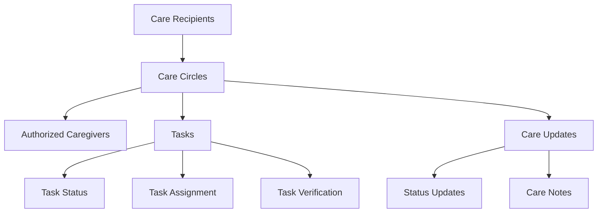

# CareSync Coordination Platform

A decentralized coordination platform for shared caregiving responsibilities, providing transparent and secure task management, updates, and care activity tracking.

## Overview

CareSync enables multiple caregivers to coordinate care activities for recipients through a blockchain-based platform. The system provides:

- Creation and management of care circles around recipients
- Task assignment and tracking
- Secure documentation of care activities
- Status updates and care notes
- Multi-caregiver coordination features
- Verification of completed tasks

## Architecture

The platform is built around the concept of care circles, where authorized caregivers can collaborate to provide care for recipients.



### Core Components

1. **Care Recipients**: Individual care recipients with associated care circles
2. **Care Circles**: Groups of authorized caregivers for each recipient
3. **Tasks**: Assignable care activities with tracking and verification
4. **Updates**: Documentation of care activities and status changes

## Contract Documentation

### caresync-coordinator.clar

The main contract handling all platform functionality:

#### Key Features:
- Care recipient and circle management
- Task creation and assignment
- Care activity tracking
- Access control and authorization
- Status updates and documentation

#### Access Control:
- Admin roles for care circle management
- Caregiver authorization checks
- Task assignment restrictions
- Verification requirements

## Getting Started

### Prerequisites
- Clarinet CLI
- Stacks wallet for deployment

### Basic Usage

1. Create a care recipient:
```clarity
(contract-call? .caresync-coordinator create-care-recipient "John Doe")
```

2. Add a caregiver:
```clarity
(contract-call? .caresync-coordinator add-caregiver recipient-id caregiver-address "assistant")
```

3. Create a task:
```clarity
(contract-call? .caresync-coordinator create-task 
    recipient-id 
    "Medication" 
    "Administer evening medication" 
    due-date 
    "high")
```

## Function Reference

### Care Circle Management

#### create-care-recipient
```clarity
(create-care-recipient (name (string-utf8 100)))
```
Creates a new care recipient and circle with the caller as admin.

#### add-caregiver
```clarity
(add-caregiver (recipient-id uint) (caregiver principal) (role (string-utf8 20)))
```
Adds a new caregiver to a care circle.

### Task Management

#### create-task
```clarity
(create-task 
    (recipient-id uint) 
    (title (string-utf8 100)) 
    (description (string-utf8 500))
    (due-date uint)
    (priority (string-utf8 10)))
```
Creates a new care task.

#### claim-task
```clarity
(claim-task (task-id uint))
```
Assigns a task to the calling caregiver.

#### complete-task
```clarity
(complete-task (task-id uint) (notes (optional (string-utf8 500))))
```
Marks a task as completed with optional notes.

### Updates and Documentation

#### post-care-update
```clarity
(post-care-update 
    (recipient-id uint) 
    (content (string-utf8 1000))
    (update-type (string-utf8 50))
    (related-task-id (optional uint)))
```
Records a care update or note.

## Development

### Testing

Run tests using Clarinet:
```bash
clarinet test
```

### Local Development

1. Initialize a new Clarinet project
2. Copy the contract into your contracts directory
3. Deploy locally using `clarinet console`

## Security Considerations

### Access Control
- Only authorized caregivers can interact with care circles
- Task verification requires different caregivers for completion and verification
- Admin roles have additional permissions for circle management

### Data Privacy
- Care recipient data is only accessible to authorized caregivers
- Task and update history is immutable
- Sensitive information should be stored off-chain with only references on-chain

### Limitations
- Maximum of 50 caregivers per care circle
- Maximum of 500 tasks per recipient
- Maximum of 500 updates per recipient
- String length limitations for various fields